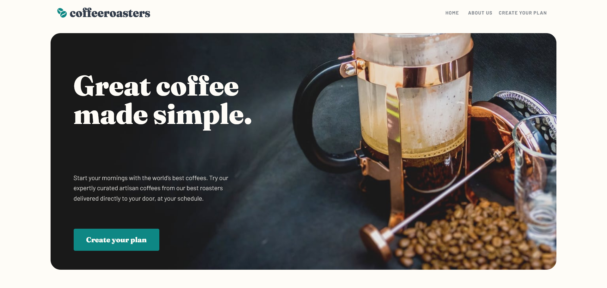

# Frontend Mentor - Coffeeroasters subscription site solution

This is a solution to the [Coffeeroasters subscription site challenge on Frontend Mentor](https://www.frontendmentor.io/challenges/coffeeroasters-subscription-site-5Fc26HVY6). Frontend Mentor challenges help you improve your coding skills by building realistic projects. 

## Table of contents

- [Overview](#overview)
  - [The challenge](#the-challenge)
  - [Screenshot](#screenshot)
  - [Links](#links)
- [My process](#my-process)
  - [Built with](#built-with)
  - [What I learned](#what-i-learned)
  - [Continued development](#continued-development)
- [Author](#author)

## Overview

### The challenge

Users should be able to:

- View the optimal layout for each page depending on their device's screen size
- See hover states for all interactive elements throughout the site
- Make selections to create a coffee subscription and see an order summary modal of their choices

### Screenshot

### Links

- Live Site URL: [Add live site URL here](https://coffee-three-phi.vercel.app/)

## My process

### Built with

- Semantic HTML5 markup
- SCSS custom properties
- Flexbox
- [Angular](https://angular.io/) - Angular Framework
- [Angular Material](https://material.angular.io/) - Angular Material

### What I learned

My first Angular App, it was a very fun challenge for me I was able to learn more about how Angular works, Angular routes and components. I also used Angular Material to build some of the components in the App.

### Continued development

Want to continue and make a profile page, where the user can see the subscription plan in use and change it if desired.

## Author

- Frontend Mentor - [@EduardoLimaCastro](https://www.frontendmentor.io/profile/EduardoLimaCastro)
- GitHub - [@EduardoLimaCastro](https://github.com/EduardoLimaCastro)
